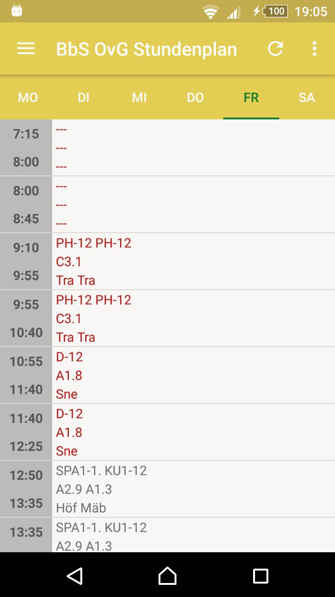
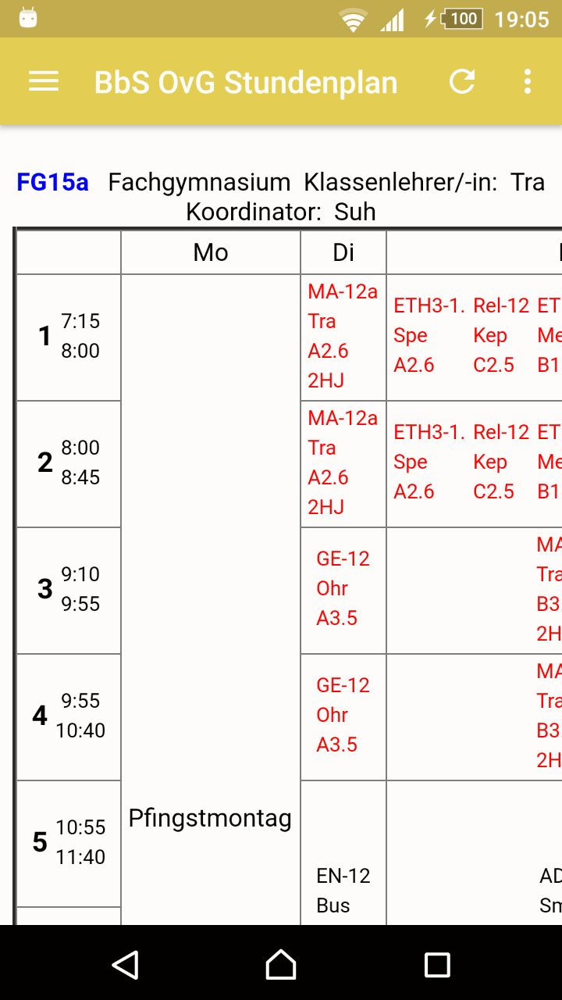
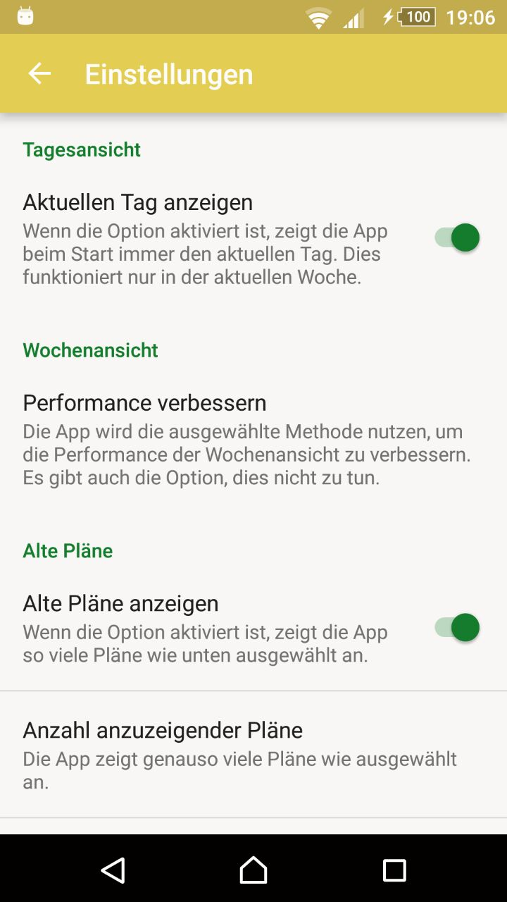
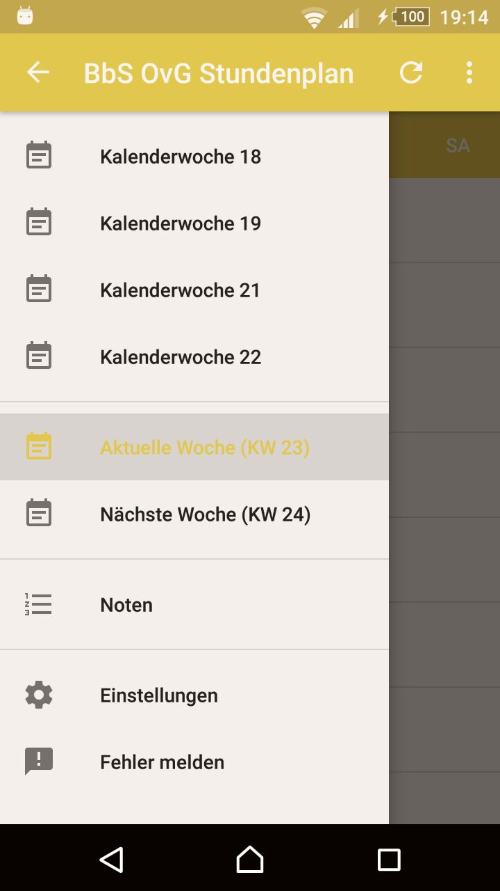

# Die Stundenplan-App für die BbS OvG III

## Was soll die App bewirken?

Diese App soll den Schulalltag vieler Schüler an der BbS OvG III vereinfachen.

## Was kann die App?

### TAGESANSICHT

Hier werden dir die Stunden, Lehrer und Räume des ausgewählten Tages angezeigt.


### WOCHENANSICHT

Hier wird dir kompakt die komplette Woche angezeigt.


### EINSTELLUNGEN 
Hier kannst du verschiedene Dinge einstellen, die für die App relevant sind.


### SIDEBAR
Hier hast du die Möglichkeit zwischen den verschiedenen Wochen zu wählen, zu den Einstellungen oder zur Tagesansicht zu gelangen.


## Was kommt in der Zukunft?

```markdown
- Notenübersicht
- Notizfunktion (z.B. für Hausaufgaben)
- Push-Benachrichtigungen
```
